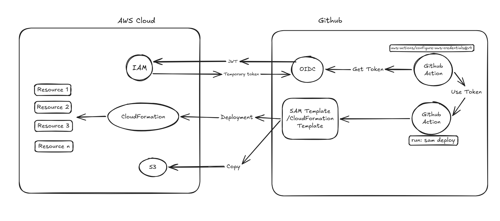
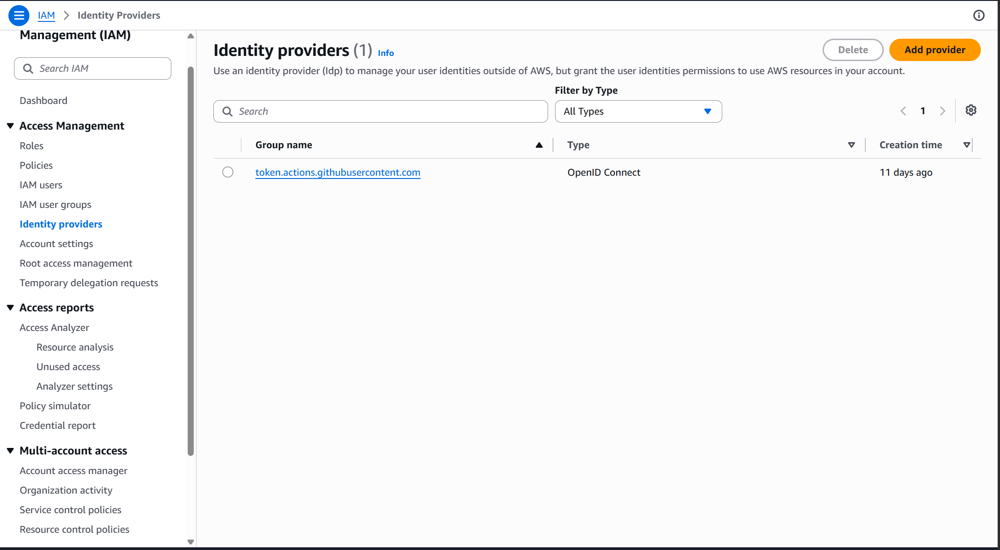

# Deploy your serverless multi-environment infra on AWS via IaC through Github Workflow 

Github Dev and Prod workflows, for deploying resources on AWS via IaC using AWS SAM (Serverlss Application Model).


## Overview


## Create the GitHub OIDC provider in IAM

In IAM > Identity providers > Add provider, choose OpenID Connect. Provider URL: token.actions.githubusercontent.com. Audience: sts.amazonaws.com. This is a one-time setup per AWS account (even if you later create several dev/prod roles on top of it).


## Write the trust policy scoped to your repo and environment

The trust policy defines WHO can assume the role. 

Important: if your GitHub Actions job references a GitHub `environment:` (e.g. `environment: { name: dev }`), the token's `sub` claim uses the format repo:<owner>@<owner_id>/<repo>@<repo_id>:environment:<env_name> — not the classic branch-based format. Never use a wildcard on the owner or repo name itself; scope it to your exact repo.

The trust Policy:
```
{
    "Version": "2012-10-17",
    "Statement": [
        {
            "Effect": "Allow",
            "Principal": {
                "Federated": "arn:aws:iam::<your-account-id>:oidc-provider/token.actions.githubusercontent.com"
            },
            "Action": [
                "sts:AssumeRoleWithWebIdentity",
                "sts:TagSession"
            ],
            "Condition": {
                "StringEquals": {
                    "token.actions.githubusercontent.com:aud": "sts.amazonaws.com"
                },
                "StringLike": {
                    "token.actions.githubusercontent.com:sub": "repo:<github-username-or-orga>/repo-name:environment:<env_name>"
                }
            }
        }
    ]
}
```
## Create the IAM role for dev and for prod

In IAM > Roles > Create role > Custom trust policy, paste the trust policy from the previous step. Give it an explicit name. Example: GithubActionsDeployRole-Dev.
## Attach a least-privilege permissions policy

Create a dedicated managed policy (not AdministratorAccess) that only allows what sam deploy needs: cloudformation:*, lambda:*, and s3:* on the SAM-managed bucket. Attach it to the dev role.

In this example, let's give the necessary permissions to deploy a stack from cli and a lambda.

```
{
    "Version": "2012-10-17",
    "Statement": [
        {
            "Sid": "CloudFormationDeploy",
            "Effect": "Allow",
            "Action": [
                "cloudformation:CreateStack",
                "cloudformation:UpdateStack",
                "cloudformation:DeleteStack",
                "cloudformation:DescribeStacks",
                "cloudformation:DescribeStackEvents",
                "cloudformation:DescribeStackResource",
                "cloudformation:DescribeStackResources",
                "cloudformation:GetTemplate",
                "cloudformation:GetTemplateSummary",
                "cloudformation:ListStackResources",
                "cloudformation:CreateChangeSet",
                "cloudformation:DescribeChangeSet",
                "cloudformation:ExecuteChangeSet",
                "cloudformation:DeleteChangeSet",
                "cloudformation:ValidateTemplate"
            ],
            "Resource": "*"
        },
        {
            "Sid": "CloudFormationChangeSetPreview",
            "Effect": "Allow",
            "Action": [
                "cloudformation:ListStacks",
                "cloudformation:ListChangeSets"
            ],
            "Resource": "*"
        },
        {
            "Sid": "SamCliBucket",
            "Effect": "Allow",
            "Action": [
                "s3:TagResource",
                "s3:GetObject",
                "s3:PutObject",
                "s3:DeleteObject",
                "s3:ListBucket",
                "s3:DeleteBucket",
                "s3:CreateBucket",
                "s3:GetBucketLocation",
                "s3:PutBucketPolicy",
                "s3:GetBucketPolicy",
                "s3:PutEncryptionConfiguration",
                "s3:PutBucketVersioning",
                "s3:PutBucketPublicAccessBlock"
            ],
            "Resource": [
                "arn:aws:s3:::aws-sam-cli-managed-*",
                "arn:aws:s3:::aws-sam-cli-managed-*/*"
            ]
        },
        {
            "Sid": "LambdaDeploy",
            "Effect": "Allow",
            "Action": [
                "lambda:CreateFunction",
                "lambda:UpdateFunctionCode",
                "lambda:UpdateFunctionConfiguration",
                "lambda:DeleteFunction",
                "lambda:GetFunction",
                "lambda:GetFunctionConfiguration",
                "lambda:ListVersionsByFunction",
                "lambda:PublishVersion",
                "lambda:CreateAlias",
                "lambda:UpdateAlias",
                "lambda:DeleteAlias",
                "lambda:GetAlias",
                "lambda:AddPermission",
                "lambda:RemovePermission",
                "lambda:GetPolicy",
                "lambda:TagResource",
                "lambda:UntagResource",
                "lambda:PutFunctionConcurrency"
            ],
            "Resource": "*"
        }
    ]
}
```

## Repeat for prod (separate role, separate account if possible)

Create GithubActionsDeployRole-Prod with a trust policy scoped to the production environment (e.g. environment:production in the sub claim). Ideally, prod lives in a separate AWS account (good architecture practice: blast radius isolation); otherwise, at minimum use a different IAM role with the same permission shape but kept strictly separate from dev.
## Retrieve the ARNs and add them to GitHub

Copy the ARN of each role (arn:aws:iam::ACCOUNT_ID:role/GithubActionsDeployRole-Dev and ...-Prod) and add them as secrets AWS_DEPLOY_ROLE_DEV and AWS_DEPLOY_ROLE_PROD in your repo's Settings > Secrets and variables > Actions.
## Don't forget sts:TagSession in the trust policy

aws-actions/configure-aws-credentials attaches session tags (repo, branch, workflow) to the AssumeRoleWithWebIdentity call by default. Make sure your trust policy's Action list includes both sts:AssumeRoleWithWebIdentity and sts:TagSession, otherwise the assume-role call fails with a generic 'Not authorized' error even when everything else is correct.
## Worflows

The workflows files in `.github/workflows` trigger a deployment in dev or prod depending the branch you push on.

You can then check in cloud formation that your stack has been created/updated.
